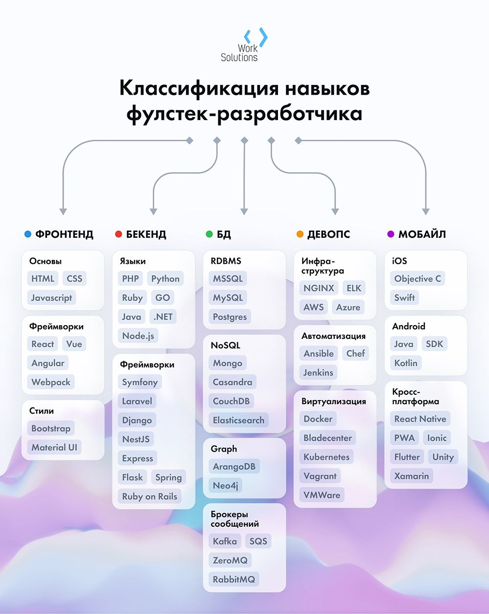

> Зло – это зло. Меньшее, большее, среднее – все едино, пропорции условны, а границы размыты. Я не святой отшельник, не только одно добро творил в жизни. Но если приходится выбирать между одним злом и другим, я предпочитаю не выбирать вообще.

А я выбираю фулл-стек

Осталось только определиться с стеком.

У меня три варианта

1) самый разнообразный JS на бэке и фронте
2) Java на бэке React на фронте
3) PHP на бэке, разнообразный фронт.

-----
JS + верстка в любом случае пригодятся. Поэтому упор сейчас на них.
-----

Прикольдесная картинка:

