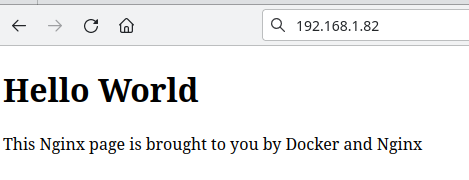

- [X] Kata
- [x] Theory
- [x] Practice
- [x] Journey
- [ ] Book

# Kata

Простенькая задачка про арифметическую последовательность

# Theory

Теория создания страниц в freeCodeCamp

# Practice

Учился поднимать локальный веб-сервер.

Взял ubuntu server и накатил на ненужную машину.
Потом подключился по ssh, поставил docker и вуаля:

Снова радость от hello world

# Journey

Пытался создать свой сайт-визитку. Просто обзорный профиль с ссылками.
Для красоты остановился снова на любимом Hugo. Видимо для полностью своего решения еще не созрел.

# Book
