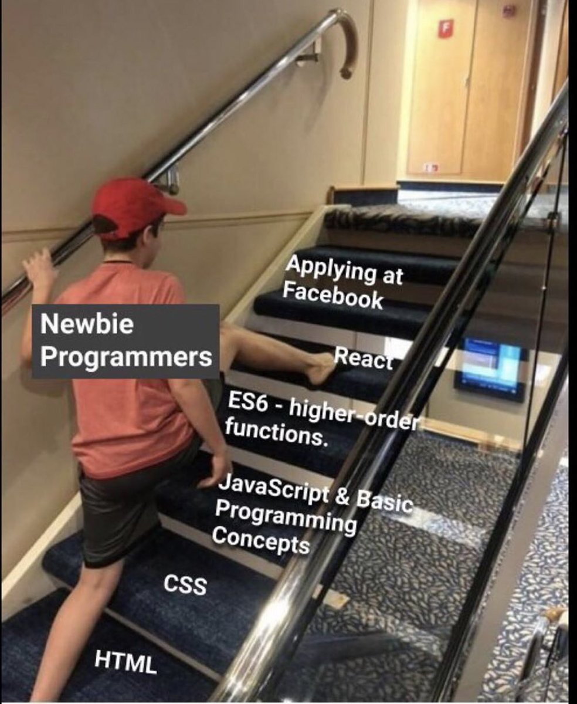

Шо у нас на фронте на 09 ноября.

- [X] Kata
- [X] Theory
- [X] Practice
- [X] Journey
- [ ] Book

Первый отмеченный день практики на новом направлении - frontend.
_Было бы очень неплохо потом пройтись по этим файлам с болгом скриптом и посчитать различную статиститку._
_Возможно даже эта прога будет написана с использованием node.js😎_

# Kata
https://www.codewars.com/kata/53da3dbb4a5168369a0000fe/javascript AHAHAH

# Theory

Надо б читать по несколько глав отсюда: https://code.mu/ru/javascript/book/prime/ либо по главе отсюда:
https://learn.javascript.ru/

# Practice

HtmlAcademy практика верстки с тренажерами. Очень нравится. Прямо практически идеальные курсы.

# Journey

Ух, глаза разбегаются от того, что можно написать. Начну со своего блога. Наверняка из-за санкций придется рано или поздно уйти от удобства связки hugo + github actions.

# Book

Надо выбрать какую читать. Выразительный JS неплоха.
Но такого прикола в ней как с Джоном-белкой-оборотнем я не выкупил. Типа про весь из себя динамический ДЖс наверное шутка. 

# Итого

Нужен режим дня. Без него фсе фигня на постном масле...

# Разное

Посмотрел классное [видео о реальной работе верстальщика](https://www.youtube.com/watch?v=UK_RTvtum2Y). Одно слово: Вау

Люблю такой кодерский юмор с С++ define: https://github.com/KanatnikovMax/znanie-drevnix

Все время хочется сделать такой шаг:

Например, прямо сейчас мне очень хочется собрать SpringBoot + React приложение. Но я банально не знаю, как правильно собрать React Приложение чтобы было удобно его использовать в Spring Boot.

По сути нужна рыба html, где будет подключаться один JS и один CSS. Но они должны быть должным образом собраны, скопированы и прописаны.

Google подсказал очень правильную картинку-решение:

