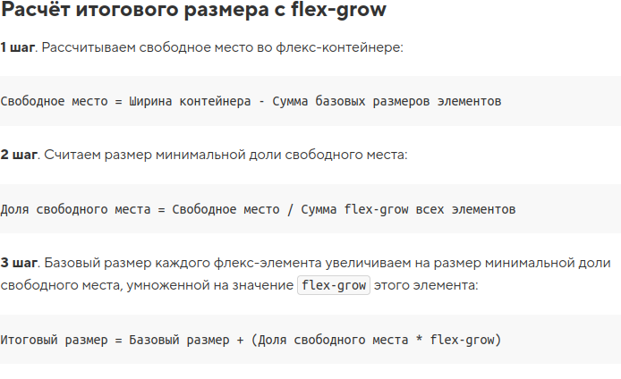

- [X] Kata
- [X] Theory
- [X] Practice
- [X] Journey
- [X] Schedule

# Kata

Easy one: https://www.codewars.com/kata/55b42574ff091733d900002f/solutions/javascript

# Theory

Досмотрел: https://www.youtube.com/watch?v=maPRR_jjyOE
Прекрасный видео-курс.

Вспомнил про экспорт модулей в React посмотрев один из выпусков React Путь Самурая
Там вторая часть выходит! Димыч продолжает бомбить. Вот это подарок! 
Есть конечно претензии, но дареному коню в зубы не смотрят.

Остановился на 14 части из 100.

# Practice

Задачи по JS на Stepic.
Практика верстки.

# Journey

Немного разбил React - компоненты в будущем блоге.

# Итого

Достаточно продуктивный денек.

# Разное

На JS можно писать конечно очень веселый код.

Стал замечать что я ухожу в сторону от верстки к JS, программированию. По-моему это еще рановато делать.
Понятно, что оно у меня получается лучше чем верстать и поэтому проще идет.

Теория по верстке также плохо заходит. Довольно сложно вникнуть какое свойство как влияет на другое свойство.
Как свойства комбинируются.

У всех элементов поведение, главное из которых изменение размера и положения достаточно не стандартное и требует разбирательство

Да, как вот сходу запомнить вот такое:

Хотел уйти от матеши, наивный юный верстальщик? О-хо-хо. Она тебя и здесь найдет!
Особенно в анимациях и 3D

-----

Первый раз воспользовался в реальной ситуации промисами. Как же круто: сегодня узнал, сегодня же и и использовал!

# Today I learned.

Callback Hell, Promise, React Components