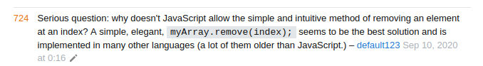

- [X] Kata
- [X] Journey
- [ ] Theory
- [ ] Practice
- [ ] Schedule


# Kata

Task: 6kyu https://www.codewars.com/kata/554ca54ffa7d91b236000023/train/javascript

### Мое решение

```js
function deleteNth(arr, n){
    let elementsToDelete = [];
    let elementCounts = {};
    for (let element of arr) {
        if(!elementCounts[element]) {
            elementCounts[element] = 1;
        } else {
            elementCounts[element] = elementCounts[element]  + 1;
        }
    }
    for (let element of arr.filter(unique)) {
        if (elementCounts[element] > n) {
            for (let i = 0; i < elementCounts[element] - n; i++) {
                elementsToDelete.push(element);
            }
        }
    }
    deleteElements(arr, elementsToDelete)
    return arr;
}

function deleteElements(array, elementsToDelete) {
    for (const elementToDelete of elementsToDelete) {
        const index = array.lastIndexOf(elementToDelete);
        if (index > -1) {
            array.splice(index, 1);
        }
    }
}

function unique(value, index, array) {
    return array.indexOf(value) === index;
}
```
### Эталонное решение
Идеальное решение. Есть куда стремиться..

```js

function deleteNth(arr,x) {
    var cache = {};
    return arr.filter(function(n) {
        cache[n] = (cache[n]||0) + 1;
        return cache[n] <= x;
    });
}

```

# Journey

Занятно, как сроки написания такого маленького проекта меняются в течении дня от "никогда не напишу" до "сегодня вечером закончу"

На третий день написания блога я опять почувствовал то, насколько же больно для мозга программировать. Надо отдохнуть.

# Разное



И вправду, почему?

.
.
.

Раньше я как-то более воодушевленно смотрел на возможность придти в фронтенд через верстку.
Однако как показывает практика, верстка это скорее фриланс, либо узкие направления, типа промо-блоков, или верстка писем.
С приходом таких фреймворков как React просто не выгодно верстать страницу целиком.