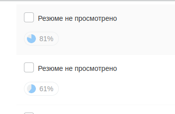

Тут я попытаюсь вести лог заваленных собседований.
Может когда-нибудь научусь проходить и относиться к нем с хладнокровием профессионала.

Итак, первое мое собеседование в жизни было завалено. -1.
Потом два собеседования прошел. +2
Потом долго собеседований не было.
Потом слету прошел еще одно. + 1
Потом полетели отказы. В целом было около 3 отказа и 2 согласия. -3 +2
И сегодняшний мой позоронейший фейл -1. Хотя я бы засчитал как -10 так непрофессионально вести собеседование.

Считаем статистику.
Проваленных собеседований: 5
Пройденных собеседований: 5

Идеальный баланс.

Вот список пунктов которые мешали мне пройти собеседования:

- не понял куда пришел
- не грамотно оценил свои силы
- не был в себе уверен
- был слишком самоуверен
- не слушал собеседующих

Что имеем в итоге:




UPD 21.07

```sql
INSERT INTO interview_stats SET fails = failes + 1, norm = norm + 1;
```