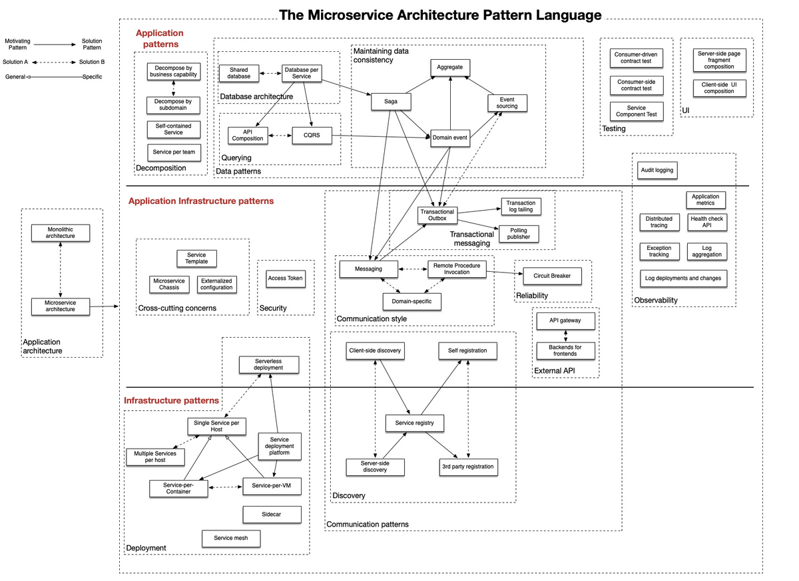

В этом посте хотел бы собрать вопросы, которые бы подошли для собеседования.
Список неполный, дополняется редко. Ответы будут браться с других сайтов.
Делается только под себя (Как и все в этом месте).

# Базы данных

## Аномалии параллельных транзакций.

1. __Потерянное обновление (lost update)__

Когда разные транзакции одновременно изменяют одни и те же данные, то после фиксации изменений может оказаться, что одна транзакция перезаписала данные, обновленные и зафиксированные другой транзакцией.

2. __«Грязное» чтение (dirty read)__

Транзакция читает данные, измененные параллельной транзакцией, которая еще не завершилась. 

3. __Неповторяющееся чтение (non-repeatable read)__

При повторном чтении тех же самых данных в рамках одной транзакции оказывается, что другая транзакция успела изменить и зафиксировать эти данные.

4. __Фантомное чтение (phantom read).__

Транзакция повторно выбирает множество строк в соответствии с одним и тем же критерием. В интервале времени между выполнением этих выборок другая транзакция добавляет новые строки и успешно фиксирует изменения.
В результате при выполнении повторной выборки в первой транзакции может быть получено другое множество строк.

5. __Аномалия сериализации (serialization anomaly)__

Результат успешной фиксации группы транзакций, выполняющихся параллельно, не совпадает с результатом ни одного из возможных вариантов упорядочения этих транзакций,
если бы они выполнялись последовательно.

## Уровни изоляции базы данных

1. __Read Uncommitted__

Это самый низкий уровень изоляции. Согласно стандарту SQL на этом уровне допускается чтение «грязных» (незафиксированных) данных.

2. __Read Committed__

Не допускается чтение «грязных» (незафиксированных) данных.
Транзакция может видеть только те незафиксированные изменения данных, которые произведены в ходе выполнения ее самой.

3. __Repeatable Read__

Не допускается чтение «грязных» (незафиксированных) данных и неповторяющееся чтение. В PostgreSQL на этом уровне не допускается также фантомное чтение.

4. __Serializable__

Не допускается ни один из феноменов, перечисленных выше, в том числе и аномалии сериализации.

## Кластерный и не кластерный индекс

Кластерный индекс — это тип индекса, который сортирует строки данных в таблице по их ключевым значениям.
Кластерный индекс определяет порядок хранения данных в таблице, которая может быть отсортирована только одним способом.
В базе данных есть только один кластеризованный индекс для каждой таблицы.
Обычно в СУБД первичный ключ позволяет создать кластеризованный индекс на основе этого конкретного столбца.

При наличии кластерного индекса строки таблицы упорядочены по значению ключа этого индекса.
Если в таблице нет кластерного индекса, таблица называется кучей.
Некластерный индекс, созданный для такой таблицы, содержит только указатели на записи таблицы. Кластерный индекс может быть только одним для каждой таблицы,
но каждая таблица может иметь несколько различных некластерных индексов, каждый из которых определяет свой собственный порядок следования записей.

## Масшатбирование БД

#### Партиционирование (partitioning)

Партиционирование — это разбиение таблиц, содержащих большое количество записей, на логические части по неким выбранным администратором критериям.
Партиционирование таблиц делит весь объем операций по обработке данных на несколько независимых и параллельно выполняющихся потоков, что существенно ускоряет работу СУБД.
Для правильного конфигурирования параметров партиционирования необходимо, чтобы в каждом потоке было примерно одинаковое количество записей.

_Например, на новостных сайтах имеет смысл партиционировать записи по дате публикации, так как свежие новости на несколько порядков более востребованы и чаще требуется работа именно с ними, а не со всех архивом за годы существования новостного ресурса._

#### Репликация (replication)

Репликация — это синхронное или асинхронное копирование данных между несколькими серверами. Ведущие серверы часто называют мастерами (master), а ведомые серверы — слэйвами (slave).
Более политкорректные современные названия — Лидер и Фолловер (leader & follower).

Ведущие сервера используются для чтения и изменения данных, а ведомые — только для чтения.
В классической схеме репликации обычно один мастер и несколько слэйвов, так как в большей части веб‑проектов операций чтения на несколько порядков больше, чем операций записи.
Однако в более сложной схеме репликации может быть и несколько мастеров.

_Например, создание нескольких дополнительных slave‑серверов позволяет снять с основного сервера нагрузку и повысить общую производительность системы, а также можно организовать слэйвы под конкретные ресурсоёмкие задачи и таким образом, например, упростить составление серьёзных аналитических отчётов — используемый для этих целей slave может быть нагружен на 100%, но на работу других пользователей приложения это не повлияет._

#### Шардинг (sharding)

Шардинг — это прием, который позволяет распределять данные между разными физическими серверами.
Процесс шардинга предполагает разнесения данных между отдельными шардами на основе некого ключа шардинга.
Связанные одинаковым значением ключа шардинга сущности группируются в набор данных по заданному ключу, а этот набор хранится в пределах одного физического шарда.
Это существенно облегчает обработку данных.

_Например, в системах типа социальных сетей ключом для шардинга может быть ID пользователя, таким образом все данные пользователя будут храниться и обрабатываться на одном сервере, а не собираться по частям с нескольких._

# Java

## Как передаются обьекты в Java?

По значению. Всегда. Ссылки - передается значение ссылки.

## Пул строк

Строка созданная с помощью литерала попадет в пул. Остальные с помощью метода intern()

## Как выбрать ключ для map?

Это должен быть immutable объект

## В чем разница между агрегацией и композицией

Ассоциация – знание одного класса о другом. Например, класс Начальник может быть связан с классом Подчиненный отношением ассоциации, чтобы передавать ему запросы. Если и Подчиненный должен обращаться к Начальнику – ассоциация называется двунаправленной.

Агрегация и композиция – две разновидности ассоциации.

Композиция подразумевает, что ассоциированный объект – «подобъект», составная часть, не имеющая смысла без ссылающегося.

Агрегация не подразумевает отношения владения.
Это просто ссылка на другой, самостоятельный объект.
Он может продолжить функционировать, если ссылающийся объект прекратит существование.

Самый мой любимый пример

книга в библиотеке - агрегация. Библиотека агрегируют книги. Но может быть и без книг, как здание. И книга может быть отдельно от библиотеки

страницы в книге - композиция. Книга состоит из страниц и без них не имеет смысла. Также и страница вырванная из книги лишена смысла.

## Иерархия классов коллекций

## Все стандартные реализации коллекций и как они устроены внутри

ArrayList - список на основе массива

LinkedArrayList - связанный двунаправленный список. Практически никогда не используется

HashMap - hashCode + buckets + List on collision + Tree on collection > 8

HashSet - внутри HashMap

TreeSet - дерево внутри

LinkedHashSet - Упорядоченное множество, когда важен порядок

## Что такое красно-черное дерево

Красно-чёрные деревья
Бинарное дерево поиска (все ключи слева меньше ключей справа)
Есть правила и по ним работают деревья чтобы избежать несбалансированности
Сами правила:

- Корень черный

- Листья null-узлы черные

- Каждый красный узел должен иметь два черных сына

- Путь от узла к листьям должен содержать одинаковое число черных узлов(черная высота)

## Как работает ClassLoader

## Какие есть примитивы синхронизации

### Мониторы
lock, synchronized

### Synchronizers
Semaphor, CountDownLatch (замок с обратным отсчетом), CyclicBarrier, Exchanger<V>, Phaser

### Concurrent Collections

Как коллекции устроены внутри и чем synchronized версии коллекций отличаются от concurrent версий

### Executors

CompletableFuture.runAsync(), FixedThreadPool, ScheduledThreadPool

### Atomics

Условно можно разделить подходы реализации большинства atomic-методов на две группы: compare-and-set и set-and-get.

Методы категории compare-and-set принимают старое значение и новое.
Если переданное старое значение совпало с текущим, устанавливается новое.
Обычно делегируют вызов в методы класса Unsafe, которые заменяются нативными реализациями виртуальной машины.
Виртуальная машина в большинстве случаев использует атомарную операцию процессора compare-and-swap (CAS).
Поэтому атомики обычно более эффективны чем стандартная дорогостоящая блокировка.

В случае set-and-get старое значение неизвестно.
Поэтому нужен небольшой трюк: программа сначала считывает текущее значение, а затем записывает новое,
тоже с помощью CAS, потому что запись могла успеть поменяться даже за этот шаг. Эта попытка чтения+записи повторяется в цикле,
пока старое значение не совпадет и переменная не будет успешно записана.

## happens-before

«Выполняется прежде» (англ. happens before) — отношение строгого частичного порядка (антирефлексивное, антисимметричное, транзитивное), введённое между атомарными командами.
Оно значит, что вторая команда будет «в курсе» изменений, проведённых первой. 

## WeakReference

- SoftReference — если GC видит что объект доступен только через цепочку soft-ссылок, то он удалит его из памяти.

- WeakReference — если GC видит что объект доступен только через цепочку weak-ссылок, то он удалит его из памяти.

- PhantomReference — если GC видит что объект доступен только через цепочку phantom-ссылок, то он его удалит из памяти. После нескольких запусков GC.

Главная плюшка SoftReference в том что JVM сама следит за тем нужно удалять из памяти объект или нет. И если осталось мало памяти, то объект будет удален.

Ну конечно WeakHashMap. Это реализация Map<K,V> которая хранит ключ, используя weak-ссылку. И когда GC удаляет ключ с памяти, то удаляется вся запись с Map

## Как устроена JVM

## Stack VS Heap

## Как работает Clone

По умолчанию protected – потому что универсальной реализации нет, а вызов приведет к CloneNotSupportedException.
Нужно писать свою реализацию, делать при этом ее public и добавлять классу интерфейс Cloneable.
Подразумевается что этот метод делает «глубокое копирование», то есть поля-ссылки копи будут вести на копии полей оригинала

Паттерн - Прототип

## Какие бывают сборщики мусора и чем они различаются?

G1, Parallel, ConcurrentMarkSweep

Сборщики мусора в Java
Добавить комментарий

Java 8: ParallelGC
Java 9 и выше: G1GC

Характеристики
Каждый конкретный сборщик мусора имеет отличительные характеристики по следующим категориям:

по работе алгоритма: Serial или Parallel. Serial для работы требует один поток. Parallel — работает в нескольких потоках.
по влиянию на приложение: Concurrent или Stop-the-World. Concurrent работает в фоне без остановки Java-приложения. Stop-the-World для работы требует остановки всех потоков JVM.
по алгоритму сборки мусора: Compacting или Non-compacting или Copying.

### Serial GC
Первый, примитивный. Прямой как палка. Для сборки мусора полностью останавливает JVM и собирает мусор в один поток.

### Parallel GC
Попытка сделать сборку быстрой и многопоточной. На многоядерных процессорах это хорошо работает. Но все равно для сборки он требует полного останова JVM.

### ConcurrentMarkSweep GC
Цель этого GC — отсрочить полную сборку мусора с остановом JVM путем запуска маленьких и коротких операций по сбору сведений о мусоре, а потом путём быстрых и коротких операций — убрать, что можно.
Если достигается определенный процент использованного heap, т.е. CMS-сборщик видит, что не справляется, то JVM останавливается и происходит полная сборка мусора.

Этот сборщик мусора как правило включают в тяжелых долгоработающих приложениях, которым выделяется много памяти под heap, где допускаются короткие задержки на быстрые легкие стадии сборки мусора,
а длинные stop-the-world паузы желательны лишь в редких критических случаях.

На замену ему уже давно вышел сборщик мусора GCG1. В Java 8 сборщик CMS обозначен как deprecated, а в скором будущем CMS будет выпилен из JVM вообще и про него можно будет благополучно забыть.

### G1 GC

основной целью сборщика G1 является минимизация пауз в работе основного приложения

### Shenandoah GC
Shenandoah GC позиционируется как сборщик, который стремится поддерживать короткие паузы даже на кучах большого объема,
за счет выполнения как можно большего количества работы по сборке мусора в конкурентном режиме, то есть одновременно с работой основных потоков приложения.
-XX:+UseShenandoah

### Z GC
Для очень больших хипов — до нескольких терабайт. Цель — гарантировать паузы на сборку мусора на таком хипе максимум 10 миллисекундами.
Появился в Java 11 как экспериментальный.
Требования:
Поддерживать паузы STW на уровне меньше одной миллисекунды.

Сделать так, чтобы паузы не увеличивались с ростом размера кучи, количества живых объектов или количества корневых ссылок.

Поддерживать кучи размером до 16 ТБ.

### Epsilon GC
Подход, используемый Epsilon GC, описывается коротко — он вообще не собирает мусор,
а просто завершает работу приложения сразу, как только оно попыталось аллоцировать больше памяти, чем ему дозволено (больше значения Xmx).

## Характеристики сборщиков мусора

- Максимальная задержка. максимальное время на которое сборщик мусора приостанавливает работу приложения Stop The World
- Пропускная способность. Отношение времени сборки мусора к общему времени работы программы
- Потребляемые ресурсы(память, ЦП)

## GC roots

- local variables
- active threads
- static variables
- JNI references

## Куда подевался PermGen?

## Java Memory Model

## Как работают Stream внутри

Лениво. Без терминальных операций не работают и после них тоже.

## Как работают Parallel Stream внутри

Не всегда параллельно

## Что такое / Как работает JIT-компиляция

технология увеличения производительности программных систем,
использующих байт-код, путём компиляции байт-кода в машинный код или в другой формат непосредственно во время работы программы

# Spring

## Что делает @SpringBootApplication

- [ ] @SpringBootConfiguration
  - [ ] @AutoConfigurationPackage
- [ ] @EnableAutoConfiguration
- [ ] @ComponentScan

## Что такое BeanFactoryPostProcessor и когда он используется?

BeanFactoryPostProcessor работает над описаниями бинов или конфигурационными метаданными перед тем, как бин будет создан.
Spring поставляет несколько полезных реализаций BeanFactoryPostProcessor, например, читающий property-файлы и получающий из них свойства бинов.

## Что такое BeanDefenitions

BeanDefinition — это специальный интерфейс,через который можно получить доступ к метаданным будущего бина.
В зависимости от того, какая у нас конфигурация, будет использоваться тот или иной механизм парсирования конфигурации.

## Виды scope

singleton - Возвращает один и тот же экземпляр бина на каждый запрос контейнера Spring IoC (по умолчанию).

prototype - Создает и возвращает новый экземпляр бина на каждый запрос.

request - Создает и возвращает экземпляр бина на каждый HTTP запрос*.

session - Создает и возвращает экземпляр бина для каждой HTTP сессии*.

global-session - Создает и возвращает экземпляр бина для глобальной HTTP сессии*. 

## Жизненный цикл бина

## Жизненный цикл контекста

Spring Boot Потрошитель

Читается конфигурации на основе них создаются BeanDefenation

BeanFactory создает бины  и инициализирует их с помощью BeanPostProcessor

## Преимущества IoC
IoC - inversion of control, один из видов(реализаций) - DI, Dependency Injection
При применении DI, ваш код становится чище, проще, его становится легче понять и тестировать.
Согласно паттерну DI, создание объектов для зависимостей переходит на фабрику или отдается третьей стороне.
Это означает, что мы можем сосредоточиться на использовании этих объектов вместо их создания.

## Как написать свой Spring Boot Starter ?

См. [Starter](https://doka.blog/posts/spring-boot-starter/)

## Пример Prototype inside singleton.

Как работает инъекция прототипа в синглтон?

Допустим ситуацию, когда в singleton-компонент внедряется зависимость со скоупом prototype – когда будет создан её объект?

Если просто добавить к определению бина аннотацию @Scope(SCOPE_PROTOTYPE), и использовать этот бин в синглтоне через аннотацию @Autowired – будет создан только один объект.
Потому что синглтон создается только однажды, и обращение к прототипу случится тоже однажды при его создании (при внедрении зависимости).

Примитивный способ получать новый объект при каждом обращении – отказаться от @Autowired, и доставать его из контекста вручную.
Для этого нужно вызывать context.getBean(MyPrototype.class).

Воспользоваться автоматическим внедрением зависимостей можно через внедрение метода . Автовайрится не сам объект, а производящий его метод.

Более красивый декларативный способ – правильно настроить определение бина.
В аннотации @Scope кроме самого scopeName доступен второй параметр – proxyMode. По умолчанию его значение NO – прокси не создается.
Но если указать INTERFACES или TARGET_CLASS, то под @Autowired будет внедряться не сам объект, а сгенерированный фреймворком прокси.
И когда проксируемый бин имеет скоуп prototype, то объект внутри прокси будет пересоздаваться при каждом обращении.

Что заинжектить бин в самого себя нужно использовать @Lazy

## Виды проксирования в Spring

- Динамическое и CG LIB

или

- С помощью интерфейсов или наследования

И, если класс имеет хотя бы один интерфейс, то именно JDK dynamic proxy и будет использоваться
(хотя это можно изменить, явно задав флаг proxy-target-class

## Зачем нужна ленивая инициализация?

**Отложенная (ленивая) инициализация**) — приём в программировании,
когда некоторая ресурсоёмкая операция (создание объекта, вычисление значения) выполняется непосредственно перед тем, как будет использован её результат.

Ускорить инициализацию. Использовать ресурсы по мере необходимости

## Hibernate и Lazy

Сказать про транзакцию))

## Rollback транзакции

По умолчанию Spring откатывает транзакции только в случае непроверяемого исключения.
Проверяемые же считаются «восстанавливаемыми» из-за чего Spring вместо rollback делает commit

## Пример Transaction call inside bean \ Scheduled.

Транзакция не будет создана из-за проксирования, так как класс вызовет сам себя, а должен вызваться извне прокси

## Какие настройки есть у аннотации Transactional

propagation - способ "распространения" транзакций

Выделяется следующие способы:

MANDATORY - если есть текущая активная транзакция - выполняется в ней, иначе выбрасывается исключение

NESTED - выполняется внутри вложенной транзакции, если есть активная, если нет активной - то аналогично REQUIRED

NEVER - выполняется вне транзакции, если есть активная - выбрасывается исключение

NOT_SUPPORTED - выполняется вне транзакции - если есть активная, она приостанавливается

REQUIRED - (значение по умолчанию) - если есть активная, то выполняется в ней, если нет, то создается новая транзакция

REQUIRES_NEW- всегда создается новая транзакция, если есть активная - то она приостанавливается

SUPPORTS - если есть активная - то выполняется в ней, если нет - то выполняется не транзакционно

Правила управления откатом

noRollbackFor и noRollbackForClassName - определяет исключения, при которых транзакция НЕ будет откатана

rollbackFor и rollbackForClassName - определяет исключения, при которых транзакция БУДЕТ откатана

# Microservices

## Паттерны микросервисов

[microservices.io](https://microservices.io/patterns/index.html)

## Как верехне-уровнево работает Kafka

## Зачем нужны consumer's group id.

Чтобы много консьюмеров обьединившись в группу читали один топик по разделам.

# Clean Code

## Design Patterns

## SOLID

S – Single Responsibility (Принцип единственной ответственности)

Каждый класс должен отвечать только за одну операцию. Единственная причина для изменений.

O — Open-Closed (Принцип открытости-закрытости)

Классы должны  быть  открыты для расширения, но закрыты для модификации.

L — Liskov Substitution (Принцип подстановки Барбары Лисков)

Если П является подтипом Т, то любые объекты типа Т, присутствующие в программе, могут заменяться объектами типа П без негативных последствий для функциональности программы.

I — Interface Segregation (Принцип разделения интерфейсов)

Не следует ставить клиент в зависимость от методов, которые он не использует.

D — Dependency Inversion (Принцип инверсии зависимостей)

Модули верхнего уровня не должны зависеть от модулей нижнего уровня. И те, и другие должны зависеть от абстракций. Абстракции не должны зависеть от деталей. Детали должны зависеть от абстракций.

## GRASP

General Responsibility Assignment Software Patterns

Слабая связанность, высокое зацепление

Слабая связанность -  сила взаимосвязей между модулями должна быть слабой

Высокое зацепление - мера силы взаимосвязанности элементов внутри модуля

[Бонус для долиставших](https://www.youtube.com/watch?v=QI-bXKC2mvU)