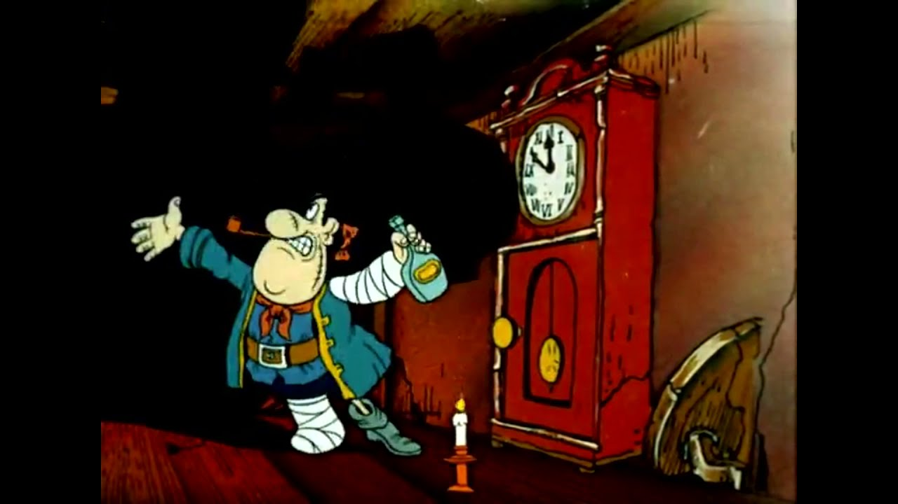

Итак, вечеринка только начинается. Что дальше в моих планах по изучению.

-----
## HTML Academy 
[Большой курс HTML Academy "Фронтенд-разработчик"](https://htmlacademy.ru/profession/frontender)

[Тренажеры HTML Academy](https://htmlacademy.ru/roadmap)

## Stepik

[JS для начинающих](https://stepik.org/course/2223/syllabus)

[Frontend разработчик на HTML, CSS и JavaScript](https://stepik.org/course/113402/promo)

[Компетенция Верстальщик - HTML, CSS, JavaScript](https://stepik.org/course/120081/promo)

[Сайт на Wordpress, Верстка сайта и перенос на CMS](https://stepik.org/course/113393/promo)

## Youtube

[React-ниндзя](https://www.youtube.com/watch?v=gb7gMluAeao)

[с 0 до 1](https://www.youtube.com/@vadymprokopchuk)

[ВебАкадеми](https://www.youtube.com/@WebCademy)

    
## Доп.материалы:

[Codewars](https://www.codewars.com/dashboard)

[Учебник по JS](https://learn.javascript.ru/)

[Учебник по JS 2](https://code.mu/ru/javascript/book/prime/)

[FreeCodeCamp](https://www.freecodecamp.org/learn)

## Portfolio
7 проектов по верстке, среди которых будет:
- что-то красивое, прям "вау" с анимациями, слайдерами и прочим
- интернет-магазин
- лендинг
- дашборд

## Свои проекты
- Блог
- ...

## Другое

Профссионально освоить ФШ и прочие инструменты для создания контента.

К чему я все это?

К чему все эти бесконечные посты о статусе, о прогрессе, о том, что можно сделать?

Внезапно я понял, что у меня мало времени. Точнее оно есть.. но есть как в Острове Скоровищ у Билли Бонса. Вот оно есть и вот его уже нет.

А поэтому. Нечего больше сомневаться. Нет времени на это.

Пристегнулись и полетели!

