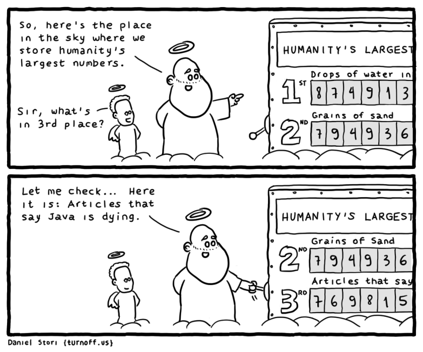

## Технологии вторичны, люди первичны.

Сначало было Слово. Потом были Люди. А уже потом технологии.

Просто дружеское напоминание: Люди первичны, технологии вторичны.

В сети часто можно встретить выражения по типу: технология X умерла, технология Z застряла в развитии и так далее.

Так конечно можно говорить, но факту технологии не являются живим обьектом и не могут умереть.

## Technolodgies are never die

Технологии не умирают. Умирают люди, которые использовали те или иные технологии.

Возможно этот подход позволит мне быть более человечным в сфере IT, да и вообще в жизни.

