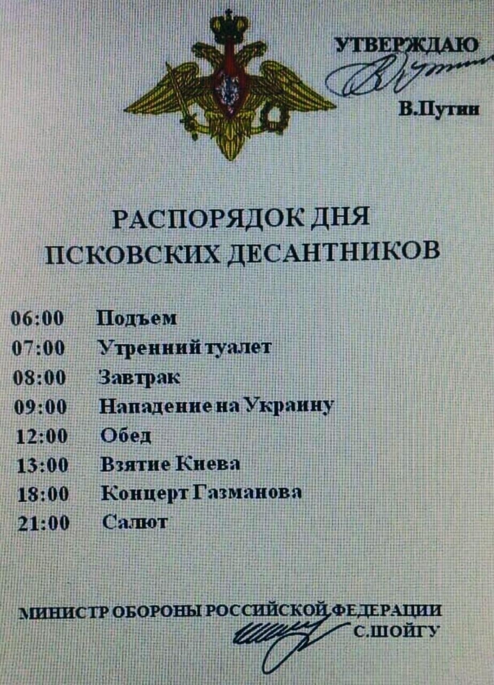
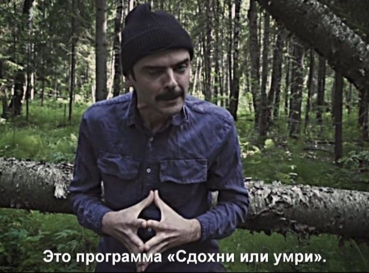

Над расписанием своего дня я работал достаточно долго. НО все равно он ВСЕГДА выходит такой:



Итак, не смейтесь, уважаемые многострадальные посетители моего убогого блога.

План-распорядок моего дня (версия 1.0.0.999)
```json
{
    "07:00": "Подъем",
    "07:30": "Завтрак",
    "08:00": "Kata",
    "09:00": "Practice",
    "12:00": "Theory", 
    "13:00": "Обед", 
    "13:30": "Journey",
    "16:00": "Перекур", 
    "16:30": "Practice", 
    "17:30": "Theory ", 
    "18:00": "Вечерний чай", 
    "18:30": "Journey", 
    "20:00": "Окончание дня", 
    "21:00": "Отбой"
}
```
Отныне распорядок дня будет отслеживаться каждый день P(P - Practice день, день практики, если кто еще не понял)!

План конечно такой, в стиле:



Но ничего, посмотрим, насколько он реалистичен.

*Какой-то план-распорядок все-равно нужен. Когда сидишь предоставленный сам себе то становится очень грустно :(*

Спустя неделю...

План-распорядок моего дня (версия 1.0.0.999.RELEASE)
```json
{
   "13:30": "Practice",
   "16:00": "Перекур",
   "16:30": "Practice",
   "18:00": "Отдых",
}
```

UPD(21.11):

План-распорядок моего дня (версия 1.0.0.999.HOTFIX)
```json
{
   "13:30": "Practice",
   "16:00": "Перекур",
   "16:30": "Journey",
   "18:00": "Отдых",
}
```