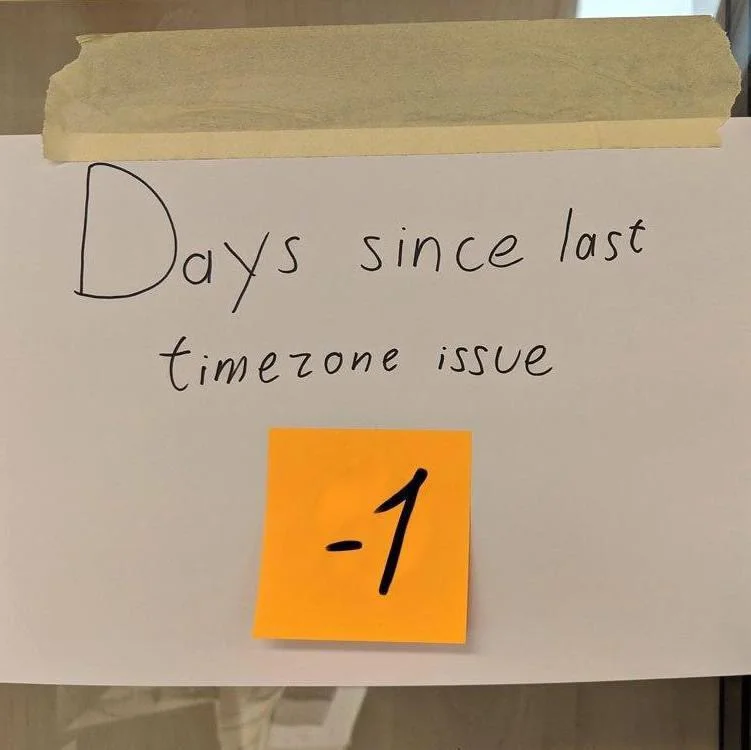

Постараюсь перечислить вещи, которые я ненавижу в IT и около айти. Многое из перечисленного уже есть во всяких списках, но хочется собрать все в одном месте, высказав при этом личное фи этим явлениям.

> Просьба для впечатлительных и малолетних отойти от экрана ибо сейчас тут будет хейт-спич, жир, желчь, набрасывание на вентилятор и малообоснованные брызги слюны во все стороны.

# айти и общество

### 1. Информационные технологии как инструмент для лжи

Ни для кого не секрет, что с появлением подобной трибуны, как Интернет, количество ложной информации и скорость ее распостранения стали просто зашкаливать. Обманывать, врать, распостранять дезинформацию, лоббировать определенные мнения стало многократно удобней.

Конечно люди всегда лгали друг другу, но сейчас это просто стало неимоверно удобно делать с помощью информационных технологий. Молниеносно, анонимно, практически без последствий и так далее.

Из-за этого новости порой выглядят как сплошные опровержения опровержения фейка трех-месячной давности.
Из-за этого распостранились куча странных псевдонаук, мифов и прочее. 
Из-за этого любая полезная информация теперь может быть только разве отрыта среди кучи мусора и подлежит перепроверке.

### 2. Информационная неграмотность обывателей.
До многих простых людей не дошел простой факт, что мы живем в информационную эпоху. И что информация, умение ее добывать и хранить сейчас решает. Поэтому многие относятся к информационным технологиям как к чему-то простому, лишнему и не нужному.

Эти люди с радостью отдадут вам свой жесткий диск или флешку с кучей личных данных. Поставят на самые важные аккаунты простейшие пароли. Без колебаний отдадут деньги интернет-мошенникам. Будут рассылать тысячи разноцветных картинок-открыток по whatsapp, даже не умея это делать. Отдадут десятки тысяч за переустановку Windows. А потом дома попросят тебя починить пылесос, так как тыжпрограммист, все знаешь.

Да и айти - это не технология, это магия. Поэтому легко можно просить машину сделать за тебя дело, а самому при этом пальцем об палец не ударить.

### 3. Deus ex machina
Злит мнение или подход, что айти решит все проблемы. Доставит людей в космос, сделает всех счастливыми, распределит блага и прочее. Надо только ждать и работать как при социализме и когда-нибудь все будет в кайф. 

Порой когда нужно решить реальную проблему, например потушить пожары, предлагают решить это с помощью информационных технологий. Мониторинга с дронов, системы оповещания и так далее. А так, чтобы лес не палить или закупить/сделать пожарные самолеты/вертолеты или поднять зарплату пожарным, нанять много лесничих это неееее. Прошлый век. Айти за нас все сделает. И пожары потушит и людей вылечит. Тьфу.

### 4. айти на хайпе
Пафос, очень много пафоса. Небоскребы-офисы, многотысячные корпорации, золотые парашюты. Почему-то гордыню назвают главным качеством программиста. Это странно. Зачастую все это вкупе порождает много айтишного гонора, отделение программистов в отдельную касту и суб-культуры, священные войны внутри самого айти и прочее. Программирование по какой-то случайной причине становится элитарным занятием в массовом сознании.

Также айти иногда окутывает завеса тайны, непроницаемости, загадки. Якобы там и люди, то не люди, а все через одного гении. Да и не работа там, а сказка. Пьешь смузи, лежишь на пляже и пишешь разноцветные буковки и все по магии начанает работать. Возможно это старый миф, но тем не менее. Да, работа в айти не сказка, но весь этот хайп порождает также и необоснованную зарплатную сегрегацию. Почему хирург, который завтра будет меня оперировать и спасать мою жизнь, получает в разы меньше чем я, который сегодня с удовольсвием крашу кнопочки, задавая запросы в гугл о том как это правильно делать. 

А чего стоят псевдо-философские движения и лозунги вроде "рожден кодить" или digital nomad( что вообще может одиночка сделать в айти?)... Иногда от этого пафоса и в целом звездной айти болезни хочется бежать в горы и пасти там овец.

### 5. Пузыри.
Много об эту тему копий сломано, но надувать можно не только простых обывателей, людей, которые хотят вкатиться, не только старушек по телефону, но и обманывать миллионы людей, корпорации, банки, создавать пирамиды, продвигать несущественные применения информационных технологий вроде нфт или криптовалют и прочее. Никто не знает что это, но готовы тратить деньги. Для айти это классика. К сожалению. 

# айти и образование

### 6. Отсутствие реально полезных сайтов/приложений или их малое количество. 

Все мы знаем где искать мемы, обзоры на игры или новости. Но где искать сайт (как он называется?), который подробно расскажет как, например, устроена стиральная машина? Не копипастный сайтец с двумя тремя разными картинками и тонной рекламы, а например **3D модель, где можно самому разобрать машину до винтиков, посмотреть как можно заменить/починить каждую деталь** . Неужели это так просто и понятно каждому?

Почему когда сломается стиральная машина, то самым полезным будет видео пятилетней давности от Сан Саныча, который хоть и мастер, но записывает свои действия в помещении без света и на тапок, который держит в зубах. 
Почему самый полезный сайт о строительстве дома и ремонте(то что нужно 80% мужчин) это форум 20 летней давности.. 
Где нормальные курсы по физике, которые показывали бы физические процессы в продвинутой симуляции, а не на картинках и анимациях из советской эпохи.

Отдельная тема это государственные сайты, сайт налоговой и прочие подобные вещи. Зачастую ими невозможно пользоваться, хотя по своей полезности массам, они должны быть самыми удобными. К счастью в этом деле есть подвижки. 

### 7. Инфоцыганство и курсы по разводу мамонтов. Cursed official education.
Айти хайп подогрел желание навариться у "продавцов лопат". Только продать лопату во время золотой лихорадки это одно, тут трудно обмануть. А вот передать священные занания JavaScript сантехнику Васе это другое. Тут можно лгать напропалую, затягивать дело до невозможности, нагонять пафоса и грести бабосики. *Лопатой*. Или например можно учить детей играть в майнкрафт, а родителям говорить, что учишь программированию и навыкам будущего и так далее. Перечислять все тошно.

Государственное образование зачастую тоже страдает. Программы устаревшие. Некоторые преподы вызывают острые приступы кринжа. Отдельное мучение видеть со стороны как иногда косо и криво преподают то, что ты хорошо знаешь и можешь рассказать за пять минут.

# айти и негатив 

### 8. Угрозы взлома, сливов.
То, что человек может построить, человек же и может сломать. Как только секретная информация появляется в виде удобном для распостранения, тут же надо бороться с тем, чтобы она не всегда была удобна для распостранения. А только определенными лицами в определенных случаях. И тут начинается эпопея.
Информационная безопасность это сложно.
Но многих это не волнует. А многих волнует на профессиональном уровне. В итоге тратятся миллионы шекелей, а инфа все равно сливается. 

При этом уровень доверия к айти не падает. Так как нет альтернатив. Ну вот нужен твой телефон для логина и все тут. А завтра выслушивай специалистов службы безопасности. В лучшем случае.

### 9. Повышенное внимание со стороны властей. 
TikTok это угроза национальной безопасности. Ютуб надо запретить. В масс-шутинге виноваты игры. Во время военных операций самые нужные в стране это оказывается программисты и им первым нужна бронь. Чем больше сайтов заблокировано тем лучше. Нам нужен чебурнет. И так далее. 

Вся эта ересь со стороны властей идет от необразованности и прочих причин перечисленных мной выше. Да, часто это выглядит как надоедливый писк комара, но порой напрягает, когда хочется поработать, а впн заблокирован. Или сайт с ответами недоступен по той же причине. Или твое абсолютно безвредное приложение удалено по политическим причинам. 

### 10. Зловещая кремниевая долина

Не то чтобы я верил в скорое наступление антиутопий. Но несколько сценариев уже технически реализуемо. Например проставление всем с рождения уникальных RFID меток с числовым идентификатором из глобального реестра. Ведь все понимают, что привязывание к номеру телефона разных госуслуг и банковских карточек это большой и большой костыль. С точки зрения государства это более чем рационально и осуществимо. Почему бы нет в целом.

Куда это приведет это вопрос. Распостранение нейроинтерфейсов тоже штука которая сулит много удобств, но и множество проблем. Концом света это не станет.. да и скорее случится ядерная война, чем этот сценарий зайдет в крайне негативное русло. Но суть претензии в том, что айти теоретически может способствовать порождению чудовищного будущего для многих. Конечно это возможно только при неумелом использовании технологий ограниченной кучкой власть-имущих. 

### 11. Неуместная реклама
Информационные технологии - инструмент номер один для рекламы сейчас. Лучшие умы планеты бьются над тем, чтобы увеличить охват, конверсию, сосчитать клики и прочее. Что мы наблюдаем в итоге.

Рекламу в системных мобильных приложениях. Я уже заплатил за телефон немалую сумму. Зачем пытаться на мне заработать дальше, впихивая рекламу в инструменты очистки памяти, просмотр видео и так далее? Зачем мне трижды на дню пихать эту рекламу карусели обоев, которая есть карусель рекламы. 

А сайты, где 90% экрана занимает реклама в виде всяких поп-апов порой вызывает весьма реальную ярость и желание крушить-ломать. Если такой сайт еще и не адаптивен и находится на первой странице в поисковой выдаче, то я за себя не отвечаю.
Бесят сайты которые перед просмотром видео или текста о том, как бинтовать раненую руку или остановить кровотечение, рекламируют тебе чипсы/дурацкий сериал/etc в течении 1.5 минут. Подобное просто должно перестать существовать. 

# айти и работа

### 12. Легаси, обратная совместимость
Порой из-за так называемой обратной совместимости или по иным причинам приходится поддерживать старье и тем самым еще более упрочнять его положение. Вдалбливать тяжеленные и неповоротливые обьемы технологий глубже и глубже, чтобы следующим поколениям выдернуть эту сваю (на которой все держится) было совсем трудно. При чем этим страдают не только программы, но и сами технологии, протоколы, языки программирования и машины, на которых как в прошивках, так и в переферии куча старья накоплено и прикручено.  

### 13. Вендор-лок
Заблокированность на проприетарных технлогиях может загнать компанию или людей в некое подобие ловушки. Это сильно напрягает, когда не можешь отказаться от оборудования, и оно уже стоит и куплено, но при этом к тебе должен приехать человечек с флешкой за тысячу километров, чтобы просто включить твой станок. Или когда банкротится фирма, которая должна была выпустить прошивку к твоим глазным имплантам или кардио-стимулятору. Короче ситуаций тут возможна тысяча. Даже просто специфичный формат файла может оказаться капканом в будущем. 

### 14. Есть 13 конкурирующих стандартов.
Хорошо когда стандартов несколько. И ты можешь выбрать наиболее подходящий. Но когда их сотни начнаешь теряться. И перепрыгивать с одного на другое. Тоже самое касается и решения программных проблем. Должен быть один или два удобных и хорошо задокументированных способа сделать то, что делают в тысячи компаний по всему миру. Но нет, миллионы человеко-часов тратятся на одно и то же. На решение задач, которые уже решили где-то. В итоге изобретается очередной велосипед.
В итоге программы, приложения, разъемы множатся, а качество не растет.  

### 15. Негативное влияние айти на здоровье
Глаза, спина, седалище, пищеварительная система, малая подвижность, туннельные синдромы это все понятно. Но это далеко не все и во многом зависит от образа жизни.

Стресс, выгорание, перегорание, сгорание, подгорание и реальный психоз часто распостранены среди айтишников. Я и сам был свидетелем подобных сцен именно со стороны людей этой сферы. То ли большие мозги в этом виноваты, то ли шальные деньги, то ли излишняя концентрация на мелочах, то ли социальная неприспособленность. Но наверное нет программиста, которые бы не ловил исключения во сне или не пытался все в жизни измерить через призму прораммирования.

К слову про физическое здоровье. Считаю, что в этом не в последнюю очередь виноваты мега неудобные и не эргономичные столы, стулья, клавиатуры и интерфейсы программ. Идеально было бы иметь полно-функциональное голосовое управление, работать полулежа или даже на бегу диктовать код и тд. Только это дорого и не распостранено пока-что. Мечтать не вредно короче.

### 16. Сложна
В айти повсюду сложно, как только речь заходит о чем-то кроме написания калькулятора.

Простой вопрос. Что нужно для работы программисту?
Перечислим:
- Постоянный доступ к энергосети
- Теплое, сухое и удобное помещение для оборудования.
- Само оборудование, множество переферии. Тут отдельный момент, так как я считаю современные вычислительные устройства одним из самых сложных устройств созданных человеком.
- Стабильный доступ к сети Интернет. Который также в топе по сложности в моей градации сложных вещей на земле.
- Множество уже созданных программных технологий, программ, сообщество, иногда доказанная математическая или иная научная база.
- Иногда доступ к внешнему оборудованию. Веб-камеры, скуды, станки и прочее в качестве обьекта предметной области.  

Таким образом, только для того чтобы приступить работать, программисту нужен набор средств, условий, техники которые даже сами по себе чрезвычайно сложны и являются плодом труда миллионов людей уже умерших и живущих поныне. Уже одно это делает работу программиста сложной. 

Некоторые абстракции или алгоритмы настолько сложны, что для того, чтобы в них досконально разобраться нужны несколько лет штрудирования определенной темы.

Да и вообще реальный мир всегда вносит свои коррективы в "идеальный" виртуальный. Взять хоть ту же радиацию влияющую на чипы или человеческий фактор.

Не сказать, что я ненавижу сложность. Но иногда это сложность разбивает иллюзии и просто заставляет ненавидеть айти. Особенно в те моменты когда: "Да почему ж оно не работает ?!?!"

### 17. Отсутствие четких критериев профессионализма
Иногда непонятно кого считать профессионалом, а кого нет. Требования не ясны, размыты. Вопросы на собеседованиях асбсурдны. Опыт работы часто нерелевантен. Технологии вечно заменяются другими и знания непостоянны. Возможно помогла бы сертификация или пересмотр существующих профессиональных стандартов, перевод их на современные рельсы.

### 18. Баги, на которые всем плевать
Баги, в целом - это норма из-за сложности создания систем. И они неизбежны. Но когда компании закрывают глаза на явные и известные всем баги или уязвимости в их продукте и делают что-то другое, откладывают фикс на несколько месяцев или лет, то возникает злость и недоумение.

### 19. Работа со временем.

Казалось бы все просто, но нюансов слишком много. Разные часовые пояса. Смена часовых поясов в обратную сторону при полете на самолете. Летнее/зимнее время, проблемы типа Y2K, разные версии библиотек и так далее.

# айти и повседневная жизнь

### 20. Проклятая модель распостранения ПО или цифрового контента
Иногда подписки это удобно. Но когда у тебя сотня разных подписок это реально раздражает. И часть из них друг друга перекрывает. Деньги улетают из кармана. Подписками нужно управлять. Иногда они внезапно дорожают. И кажется уже даже согласен на то, чтобы был какой-нибудь менеджер подписок. Но и он скорее всего будет доступен по подписке.

Иногда с подпиской все ок, но она не приносит абсолютно ничего, кроме какой-нибудь синей галочки или возможности комментировать. Иногда в подписку входит самая базовая вещь типа того же Microsoft Word. Слышно уже про подписки на функции автомобиля. Которые ты вроде купил целиком. Или например сколько раз самолично попадал в ситуацию когда оплатил что-то цифровое, но или недоступно более, или теперь невозможно перенести на другой аккаунт. Или на новой версии платформы приложение нужно покупать заново. Раньше купил кассету/диск с фильмом и все, он твой. Теперь купил фильм, а через неделю он может не быть твоим, так как продавец что-то не поладил с правообладателем. И так далее. Все это приводит к расцвету пиратства.

### 21. Беспредел и самодурство айти-гигантов
Как только айти дело начинает приносить миллионы, многим руководителям начинает срывать башню. Как это проявляется. Увольнения сотен людей направо-налево, использование сотрудников как бездушных роботов, удаленная блокировка уже купленных устройств/программ, программная блокировка мощностей, слежка за пользователями, передача персональных данных в десятые руки, замалчивание и задавливание неудобной информации, впихивание рекламы везде куда можно и нельзя, абсурдные правила использования программы/системы, свои законы подменяющие государственные, изменение привычного дизайна интерфейса на неудобный и нечитаемый, борьба с ведьмами и прочее прочее. Человеческая жадность - притча во языцех. 
 

### 22. Информационные наркотики
Ненавижу всякие онлайн-казино, мобильные приложения-убивалки времени, клонирующие друг друга, лутбоксы со скинами за реальные деньги, сотни аляповатых MMORPG, которые специально сделаны для убийства тысяч часов времени и вызывания зависимости, тупейшие видео для деградации на ютубе, реакции на реакцию на реакцию (+ детский контент там отдельный ад), которые почему-то всегда в топе популярных и прочее-прочее. 
Не то чтобы я сильно был в это вовлечен, но один факт существования этой разношерстной помойки вызывает ненависть.

Без современных информационных технологий это все невозможно. Вот почему я говорю про это здесь.
Этот трэш это не то, ради чего все айти создавалось. Ради этого корпели ученые химики, физики и математики? Ради этого в процессоры помещают триллионы транзисторов? Ради этого выстроена сложнейшая по архитектуре компьютерная сеть?

Но сейчас это мега популярно и приносит кучи легкого бабла и генерит целые стада зависимых людей. Ненавижу.

### 23. Виндовс

Тут практически без комментариев. Обновления, вызывающие синий экран смерти, куча телеметрии, трешнутый дизайн, бесполезное средство устранения неполадок, не удаляемые приложения или агенты, системные ограничения и так далее.

### 24. Внезапно умершие сервисы

Надо открыть свою новенькую Tesla приложением с телефона, но внезапно сервера Tesla упали и вы остались без машины? Знакомо, узнали? Мне не знакомо, так как я нищеброд. Но тем не менее, внезапный отказ в обслуживании от сервиса становится нормальным явлением несмотря на все заявлений хоста и дата-центров о надежности 99,99999(9). Иногда почта не работает. Иногда телефон просто на месте отключается. Вылетают даже самые надежные и проверенные программы на десктопе. Конечно у всего есть причина, но в большинстве случаев добраться до истины не так просто.

## Итог

Высказался и полегчало)
Не знаю почему, но я по-прежнему люблю эту отрасль. Что со мной не так)

